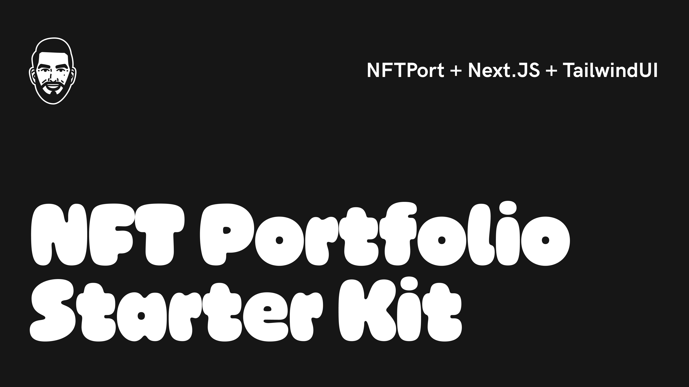

# NFTPort NFT Portfolio Starter Kit

This is a starter kit project for creating an NFT portfolio using [NFTPort](https://www.nftport.xyz/), Next.js's [`create-next-app`](https://github.com/vercel/next.js/tree/canary/packages/create-next-app), and [Tailwind](https://tailwindui.com/); additionally, it is deployable on [Vercel](https://vercel.com/).

## Getting Started

1. [Sign-up](https://dashboard.nftport.xyz/sign-up) and create an NFTPort account
2. After signing-up, copy and save your accounts [API Key](https://dashboard.nftport.xyz/api-key) for later use
3. Clone this repository
4. Rename `.env.sample` to `.env`
5. Update your environment variables file (`.env`) using your NFTPort API Key and other information about your NFT project
6. Run `npm run dev`
7. View your landing page on `localhost:3000`

Alternatively, you can deploy this starter kit using Vercel's [Deploy Now](https://vercel.com/docs/deploy-button) button:

Note, deploying to Vercel does not require any knowledge of Javascript, Next.js or software development.

To successfully deploy to Vercel, you will need the following environment variables:

| Variable        | Description           | Example  |
| ------------- |-------------| -------------|
| NEXT_PUBLIC_NFTPORT_API_KEY      | Your NFTPort API Key      |   4806f51a-f91f-456d-8cb6-b471b909c2b6 |
| NEXT_PUBLIC_NFTPORT_NFTS_ADDRESS      | A public address to retrieve contract NFTs      |   0x6C9343CA5c2Ef3a35a83438344Bb3cbE3c249f65 |
| NEXT_PUBLIC_NFTPORT_CHAIN     | The blockchain we will retreive NFTs from      |   `ethereum`, but others include: `goerli`, `polygon`, `rinkeby`, and `solana` |
| NEXT_PUBLIC_NFTPORT_DISPLAY_QUANTITY     | The number of NFTs to retreive      |   50 |
| NEXT_PUBLIC_NFTPORT_INCLUDE     | The type of data to return from NFTPort's API      |   `all`, but others include: `default`, `metadata`, and `Not Set` |

## Environment Variables

### Solana

This starter kit connects to Solana and displays NFT's created by a specific account using NFTPort's [Retrieve Solana NFTs created by an account
](https://docs.nftport.xyz/docs/nftport/b3A6Njg1NTI0MDQ-retrieve-solana-nf-ts-created-by-an-account) endpoint. 

In doing so, ensure that your `NEXT_PUBLIC_NFTPORT_INCLUDE` environment variable uses `metadata`. Using `all` or `default`, or any other value, will return eitehr a `422` error due to an invalid enumeration or insufficient data.

## Updating Content

### Logo

To update the logo, replace the `logo.png` file found within the repositories `/public` directory.

### Project Information

To update information such as as the landing page's project title (ex. `Bored Ape Yacht Club`), update the `retreive.js` file within the `components/nfts` directory.

## Roadmap

This repository is just a starter kit, but I will be expanding it to include:

- [ ] Add [Wagmi](https://wagmi.sh/) and the ability to connect Web3 wallets
- [ ] Enable connected wallets to create portfolio pages
- [ ] Who really knows (wink, wink)

## Contributing

Feel free to fork, submit pull requests and contribute.

## Questions

If you have any questions, feel free to email me at: [sergio.m.villasenor@gmail.com](mailto:sergio.m.villasenor@gmail.com).